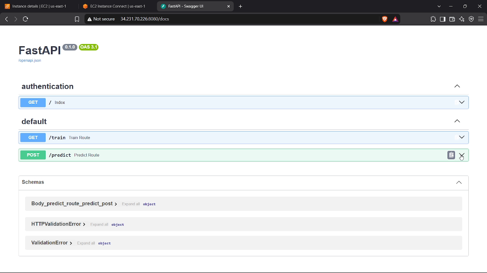
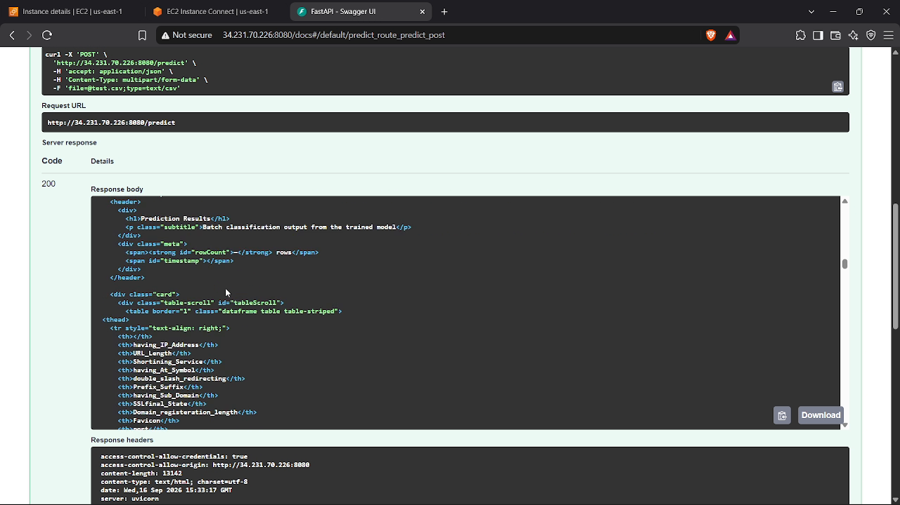
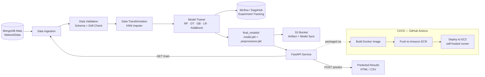
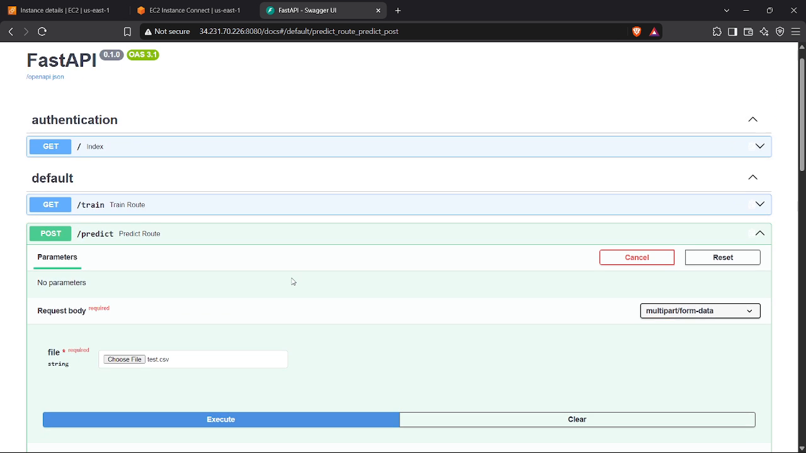
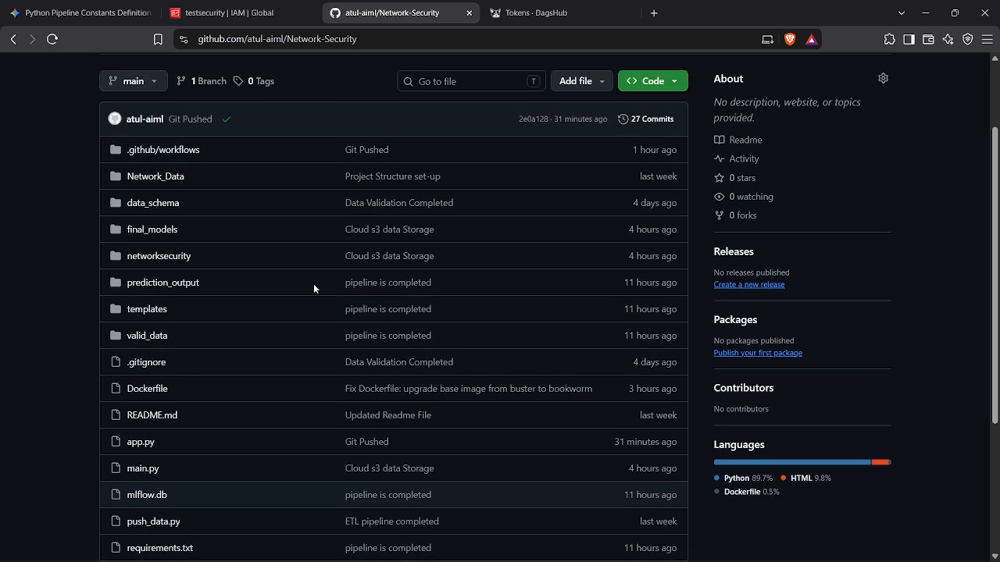

<div align="center">

# 🛡️ Network Security — Phishing Website Detection

### An end-to-end MLOps pipeline that detects phishing websites and ships itself to production

[](https://www.python.org/)
[](https://fastapi.tiangolo.com/)
[](https://www.docker.com/)
[](https://aws.amazon.com/)
[](https://mlflow.org/)
[](https://www.mongodb.com/)
[](https://github.com/features/actions)

</div>

---

## 📖 Overview

**Network-Security** is a complete, production-style machine learning system that classifies websites as **phishing** or **legitimate** based on 30 URL and page-level features. Rather than just a notebook with a model, this repository implements the *full MLOps lifecycle*:

> **MongoDB → Data Validation & Drift Detection → Transformation → Multi-Model Training & Tuning → Experiment Tracking (MLflow/DagsHub) → FastAPI Service → Docker → CI/CD (GitHub Actions) → AWS (ECR + EC2 + S3)**

The result is a self-contained pipeline that can be triggered end-to-end with a single API call, and a REST service that returns phishing predictions on any uploaded CSV of website features in real time.

---

## 🖼️ Live Deployment

The service below is auto-deployed from this repo to an AWS EC2 instance by the GitHub Actions pipeline. It exposes interactive Swagger docs at `/docs`.

<p align="center">
  
</p>

<p align="center">
  
</p>

> 💡 **Note:** These screenshots were captured from a live demo and show a real (temporary) EC2 public IP. Treat any IPs/URLs in captured screenshots as illustrative — rotate credentials and re-deploy before publishing if you're reusing this exact recording.

---

## ✨ Key Features

- 🔄 **Automated ETL** — Raw phishing data is pushed into **MongoDB Atlas** and pulled back out into a versioned feature store on every run.
- ✅ **Schema-driven validation** — Every incoming batch is checked against `data_schema/schema.yaml` (30 typed columns) before it's allowed into the pipeline.
- 📉 **Data drift detection** — Uses the **Kolmogorov–Smirnov test** (`scipy.stats.ks_2samp`) to compare train/test distributions and flags drift per column in a YAML report.
- 🧩 **KNN-based imputation** — Missing values are handled via a `scikit-learn` `Pipeline` with a `KNNImputer`.
- 🤖 **Multi-model training with hyperparameter search** — Trains and compares `RandomForest`, `DecisionTree`, `GradientBoosting`, `LogisticRegression`, and `AdaBoost`, automatically selecting the best performer.
- 📊 **Experiment tracking** — Every run logs F1, precision, and recall to **MLflow**, backed by **DagsHub** for remote tracking and collaboration.
- 🚀 **Serving via FastAPI** — `/train` retrains the full pipeline on demand; `/predict` accepts a CSV upload and returns predictions as a rendered HTML table.
- ☁️ **Cloud-native artifacts** — Trained models and pipeline artifacts are synced to an **S3 bucket** after every training run.
- 🐳 **Containerized** — Ships as a single Docker image (`python:3.10-slim-bookworm`) with the AWS CLI baked in for artifact syncing.
- ⚙️ **CI/CD out of the box** — A GitHub Actions workflow builds the image, pushes it to **Amazon ECR**, and deploys it to a self-hosted **EC2** runner automatically on every push to `main`.

---

## 🏗️ Architecture



---

## 🧰 Tech Stack

| Layer | Technology |
|---|---|
| **Language** | Python 3.10 |
| **Data Storage** | MongoDB (Atlas) |
| **ML / Data** | scikit-learn, pandas, numpy, SciPy |
| **Experiment Tracking** | MLflow + DagsHub |
| **API Framework** | FastAPI + Uvicorn |
| **Templating** | Jinja2 (`templates/table.html`) |
| **Containerization** | Docker |
| **Cloud** | AWS EC2, AWS ECR, AWS S3 |
| **CI/CD** | GitHub Actions (build → push → self-hosted deploy) |
| **Packaging** | setuptools (`setup.py`) |

---

## 📂 Project Structure

```
Network-Security/
├── .github/workflows/main.yml     # CI/CD: build → ECR → EC2 self-hosted deploy
├── Network_Data/                  # Raw phishing dataset (CSV)
│   └── phisingData.csv
├── data_schema/
│   └── schema.yaml                # Expected 30-column schema for validation
├── final_models/                  # Latest promoted model + preprocessor
│   ├── model.pkl
│   └── preprocessor.pkl
├── networksecurity/                # Core package
│   ├── cloud/                     # S3 sync utility
│   │   └── s3_syncer.py
│   ├── components/                # Pipeline stages
│   │   ├── data_ingestion.py
│   │   ├── data_validation.py
│   │   ├── data_transformation.py
│   │   └── model_trainer.py
│   ├── constants/training_pipeline/ # All pipeline constants & config
│   ├── entity/                    # Config & artifact dataclasses
│   ├── exception/                 # Custom exception handling
│   ├── logging/                   # Centralized logger
│   ├── pipeline/
│   │   ├── training_pipeline.py   # Orchestrates the full pipeline
│   │   └── batch_prediction.py
│   └── utils/                     # ML + I/O helper functions
├── prediction_output/             # Saved predictions from /predict
├── templates/table.html           # Jinja2 template for prediction results
├── valid_data/                    # Post-validation sample data
├── app.py                         # FastAPI application (train/predict routes)
├── main.py                        # CLI entry point to run the pipeline once
├── push_data.py                   # One-off script: CSV → MongoDB
├── Dockerfile
├── requirements.txt
├── setup.py
└── mlflow.db                      # Local MLflow tracking store
```

---

## 🧬 Dataset & Schema

The model is trained on a phishing-websites dataset with **30 lexical, host-based, and page-based features** plus a binary target — validated against `data_schema/schema.yaml` before every run. A few representative columns:

| Feature | Type | Feature | Type |
|---|---|---|---|
| `having_IP_Address` | int64 | `age_of_domain` | int64 |
| `URL_Length` | int64 | `DNSRecord` | int64 |
| `Shortining_Service` | int64 | `web_traffic` | int64 |
| `having_At_Symbol` | int64 | `Page_Rank` | int64 |
| `SSLfinal_State` | int64 | `Google_Index` | int64 |
| `Domain_registeration_length` | int64 | `Links_pointing_to_page` | int64 |
| `HTTPS_token` | int64 | `Statistical_report` | int64 |
| **`Result`** *(target)* | int64 | — | — |

`Result` uses the classic `{-1, 1}` encoding; the transformation stage remaps it to `{0, 1}` before training.

---

## ⚙️ Pipeline Stages

| Stage | What it does | Key file |
|---|---|---|
| **1. Data Ingestion** | Pulls records from MongoDB, writes a feature-store CSV, splits into train/test | `components/data_ingestion.py` |
| **2. Data Validation** | Checks column count against schema, runs KS-test drift detection, writes a drift report | `components/data_validation.py` |
| **3. Data Transformation** | Imputes missing values with `KNNImputer`, saves the fitted preprocessor and `.npy` train/test arrays | `components/data_transformation.py` |
| **4. Model Training** | Trains 5 candidate models with grid search, logs metrics to MLflow, saves the best model | `components/model_trainer.py` |
| **5. Artifact Sync** | Pushes the `Artifacts/` and `final_models/` directories to S3 | `cloud/s3_syncer.py` |
| **6. Serving** | Exposes `/train` and `/predict` over FastAPI | `app.py` |

---

## 🚀 Getting Started

### Prerequisites

- Python 3.10+
- A MongoDB Atlas cluster (or any MongoDB instance)
- (Optional) AWS account with an S3 bucket, if you want artifact syncing
- (Optional) A DagsHub account, if you want remote MLflow tracking

### 1. Clone & install

```bash
git clone https://github.com/atul-aiml/Network-Security.git
cd Network-Security

python -m venv venv
source venv/bin/activate        # Windows: venv\Scripts\activate

pip install -r requirements.txt
```

### 2. Configure environment variables

Create a `.env` file in the project root:

```env
MONGO_DB_URL=your_mongodb_connection_string
MONGODB_URL_KEY=your_mongodb_connection_string
```

> ⚠️ `push_data.py` / `data_ingestion.py` read `MONGO_DB_URL`, while `app.py` reads `MONGODB_URL_KEY`. Set both to the same connection string to avoid a silent mismatch.

### 3. Load the dataset into MongoDB

```bash
python push_data.py
```

### 4. Run the training pipeline

Either from the CLI:

```bash
python main.py
```

or once the API is running (see below), by hitting the training endpoint:

```bash
curl http://localhost:8080/train
```

### 5. Start the API server

```bash
python app.py
```

The app boots on **`http://0.0.0.0:8080`** and redirects `/` → `/docs` (interactive Swagger UI).

### 6. Get a prediction

```bash
curl -X POST "http://localhost:8080/predict" \
  -H "accept: text/html" \
  -H "Content-Type: multipart/form-data" \
  -F "file=@valid_data/test.csv;type=text/csv"
```

This returns a rendered HTML table of predictions and also writes them to `prediction_output/output.csv`.

---

## 🔌 API Reference

| Method | Route | Description |
|---|---|---|
| `GET` | `/` | Redirects to `/docs` |
| `GET` | `/train` | Runs the full training pipeline (ingestion → validation → transformation → training → S3 sync) |
| `POST` | `/predict` | Accepts a CSV file upload (30 feature columns) and returns predictions rendered as an HTML table |

<p align="center">
  
</p>

---

## 🐳 Docker

Build and run the service locally in a container:

```bash
docker build -t network-security .
docker run -d -p 8080:8080 --env-file .env network-security
```

The image is based on `python:3.10-slim-bookworm` and includes the AWS CLI for artifact syncing to S3.

---

## 🔁 CI/CD Pipeline

Every push to `main` triggers a three-stage GitHub Actions workflow (`.github/workflows/main.yml`):

1. **Continuous Integration** — checks out the code (lint/test steps are currently placeholders, ready to be wired up to a real test suite).
2. **Continuous Delivery** — builds the Docker image and pushes it to **Amazon ECR**.
3. **Continuous Deployment** — a **self-hosted runner on EC2** pulls the latest image, stops the existing container, and restarts it on port `8080`.

<p align="center">
  
</p>

Required GitHub Secrets:

| Secret | Purpose |
|---|---|
| `AWS_ACCESS_KEY_ID` / `AWS_SECRET_ACCESS_KEY` / `AWS_REGION` | AWS authentication for ECR + EC2 |
| `ECR_REPOSITORY_NAME` | Target ECR repository |
| `DAGSHUB_USER_TOKEN` | Authenticates MLflow logging to DagsHub at runtime |

---

## 📈 Experiment Tracking

Every training run logs **F1 score, precision, and recall** for both the train and test sets via `mlflow.log_metric`, with the winning model logged as an artifact via `mlflow.sklearn.log_model`. Tracking is routed through **DagsHub**, so all runs are viewable remotely without hosting your own MLflow server.

```python
import dagshub
dagshub.init(repo_owner='atul-aiml', repo_name='Network-Security', mlflow=True)
```

---

## 🗺️ Roadmap

- [ ] Replace the CI placeholder lint/test steps with real unit tests and static analysis
- [ ] Add authentication to the `/train` and `/predict` endpoints
- [ ] Add a model registry stage (promote to `final_models/` only after passing a quality gate)
- [ ] Add request/response schema validation with Pydantic models for `/predict`
- [ ] Add a lightweight monitoring dashboard for drift reports over time

---

## 🤝 Contributing

Contributions, issues, and feature requests are welcome. Feel free to fork the repo and open a pull request.

## 📄 License

No license file is currently included in this repository. Consider adding one (e.g., MIT) to clarify how others may use this code.

## 👤 Author

**Atul**
📧 atulchoudhary3213@gmail.com
🔗 [github.com/atul-aiml](https://github.com/atul-aiml)